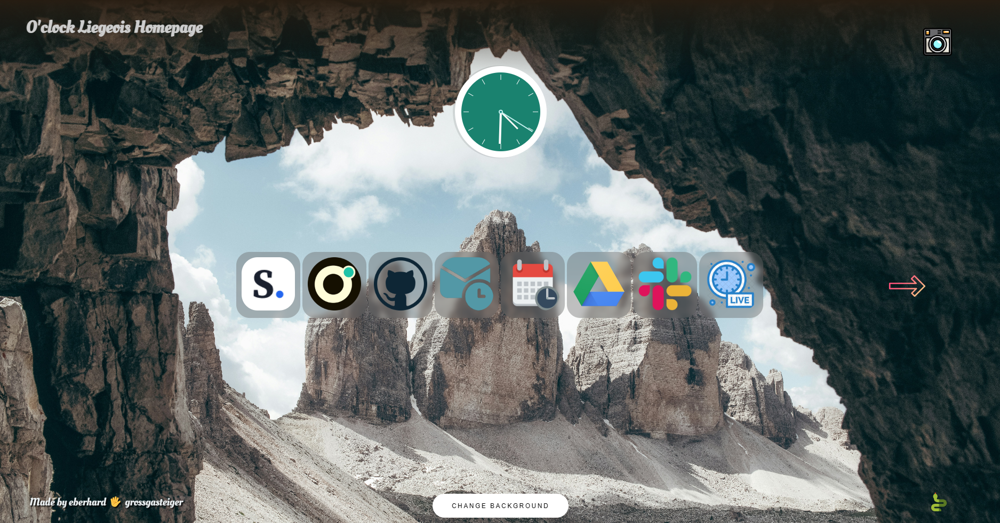

# promoliegeois.net

Petit site combinant HTML/CSS/jQuery et utilisation d'une API.
Ce site à pour but de réunir les liens essentiels pour la formation O'clock DWWM.

## Page d'accueil

## Seconde page en cliquant sur la flèche de droite

.png)

## Changer aléatoirement l'arrière plan

Utilisatation de l'API d'Unplash afin de changer l'arrière plan aléatoirement

.png)

## Nom de l'artiste
Sur chaque image, apparait le nom de l'artiste, ainsi qu'un lien vers on profil Instagram en cliquant dessus

.png)

## Sauvegarde du fond d'écran
Au premier changement de fond d'écran une petite icône d'appareil photo apparait, appuyez dessus et hop votre fond d'écran est sauvegardé pour la prochaine visite ! 

## Serpent SSSSSSS
En cliquant sur le petit serpent, un jeu apparait après une animation (tutoriel suivi pour apprendre le Javascript, le jeu à été réalisé par John Taieb)

.png)

